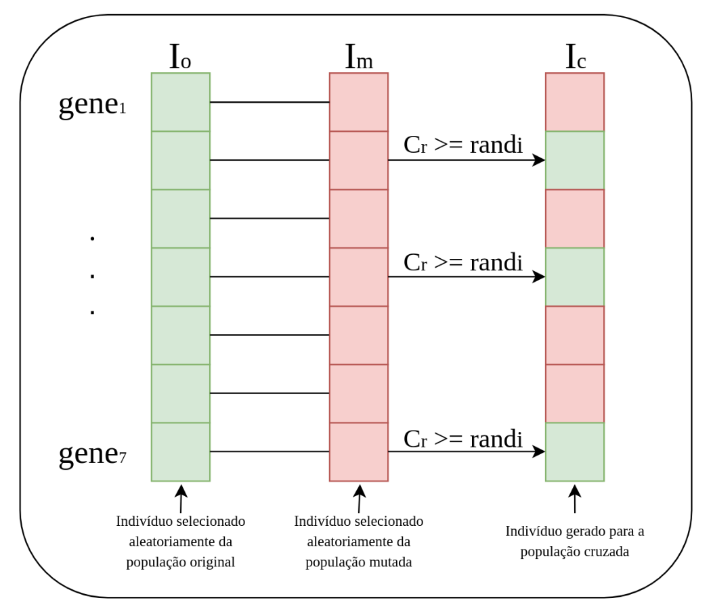

# Intro. Heurísticas
- Os algoritmos de busca BFS e DFS - $O(|E| + |V|)$ - são considerados de **busca cega**: exploram o espaço de estados sem saber se estão chegando perto do objetivo.
        - Problema disso: em espaços de estados gigantescos a busca cega sofre com a explosão combinatória.
    - DFS
        
        ```
        function DFS(G, v) is
            let S be a stack
            S.push(v)
            while S is not empty do
                v = S.pop()
                if v is the goal then
                    return v
                if v is not labeled as discovered then
                    label v as discovered
                    for all edges from v to w in G.adjacentEdges(v) do 
                        w.parent = v
                        S.push(w)
        ```
        
    - BFS
        
        ```
        function BFS(G, v) is
            let Q be a queue
            Q.enqueue(v)
            while Q is not empty do
                v = Q.dequeue()
                if v is the goal then
                    return v
                if v is not labeled as discovered then
                    label v as discovered
                    for all edges from v to w in G.adjacentEdges(v) do 
                        w.parent = v
                        Q.enqueue(w)
        ```
        
- **Heurísticas**: nada mais é do que uma estimativa informada que ajuda a tomar decisões mais rápidas. Uma regra de ouro que ajuda a guiar uma busca.
- Objetivo essencial: fornecer soluções factíveis (ou seja, não necessariamente uma solução ótima) em um tempo relativamente pequeno.
- Por isso as heurísticas são amplamente utilizadas para atacar problemas pertencentes ao conjunto NP-Hard, cujas soluções costumam ser inviáveis de resolver exatamente em tempo razoável para entradas grandes.
- **Matematicamente:**
  - A heurística é uma função `h(n)` que estima o custo do ponto atual `n` até o objetivo. De maneira geral diz: ‘quão bom é este estado?’. A medida produzida pela função (conheci como: Função de avaliação, Função Objetivo, Função de fitness, Função de custo, …) é usada para guiar os próximos passos da busca.
    - Propriedade fundamental:
                - `h(n) = 0` se n for o objetivo.
- **Heurística Construtiva**
  - Constrói uma solução do zero: a cada passo toma uma decisão em direção à solução que parece melhor no momento (normalmente, sem a opção de voltar atrás).
  - É muito rápida, mas raramente encontra a solução ótima.
  - A heurística **construtiva** encontra uma solução **rápida**.
  - Algoritmos gulosos são heurísticas construtivas: assumem que a melhor decisão local/momentânea contribuirá para uma otimização global.
- **Heurística de Melhoria (ou Busca Local)**
  - Parte de uma solução já existente e tenta modificá-la para torná-la melhor: realiza pequenas alterações (chamadas de "movimentos") na solução atual.
  - Tende a chegar mais perto do valor ótimo, mas pode ficar presa em um mínimo local.
  - A heurística de **melhoria** encontra uma solução **melhor**.
  - Para aplicar busca local, normalmente precisamos definir:
      - Representação de estado: como modelar uma solução candidata.
      - Função objetivo/avaliação: mede quão boa é uma solução.
      - Função de vizinhança: define quais soluções são *próximas* da atual.
      - Estratégia de movimentação: como escolher o próximo estado.

# A*
- Heurística construtiva
- É um dos métodos de busca de caminho mais populares e eficazes na ciência da computação.
    - Ele serve fundamentalmente para encontrar o caminho mais curto entre um ponto de partida e um objetivo em um grafo.
- Diferente de outros algoritmos, o A* é um algoritmo de **busca informada (ou heurística)**.
- Funcionamento:
    - O A* combina:
        1. o custo já percorrido até um nó;
        2. uma estimativa heurística do custo restante até o objetivo.
    - Ele escolhe expandir o nó com menor valor de $f(n) = g(n) + h(n)$
        - Onde:
            - $g(n)$: custo do início até o nó atual (”o que já custou chegar até aqui?”);
            - $h(n)$: estimativa heurística do nó atual até o objetivo (”quanto ainda falta percorrer?”);
                - Ex.: distância euclidiana, distância de Manhattan, …
            - $f(n)$: estimativa do custo total do caminho passando por n.
    - Passo a passo:
        - O A* mantém normalmente:
            - uma lista aberta (fila de prioridade iniciada na origem contendo os nós a explorar);
            - uma lista fechada (nós já explorados/finalizados).
        - Fluxo simplificado:
            1. Removemos o elemento e menor valor $f(n)$ da lista de abertas
            2. Verificamos se é o ponto final
                1. Se sim, encerra o algoritmo
                2. Se não, expandimos a busca
            3. Abrimos as células adjacentes atualizando o valor $f(n)$ de cada uma
            4. Repetimos esse processo até que não haja mais células abertas ou o ponto final tenha sido atingido
    - Algoritmo em pseudocódigo
        
        ```
        function A_Star(start, goal):
            openList = [start] // Nodes to be evaluated
            closedList = [] // Nodes already evaluated
            
            start.g = 0 // Cost from start to start is 0
            start.h = heuristic(start, goal) // Estimate to goal
            start.f = start.g + start.h // Total estimated cost
            start.parent = null // For path reconstruction
            
            while openList is not empty:
                current = openList.extract_node_with_min_f()
                
                if current = goal:
                    return reconstruct_path(current)
                    
                closedList.add(current)
                
                for each neighbor of current:
                    if neighbor in closedList:
                        continue  // Skip already evaluated nodes
                        
                    // Calculate tentative g score
                    tentative_g = current.g + distance(current, neighbor)
                    
                    if neighbor not in openList:
                        openList.add(neighbor)
                    else if tentative_g >= neighbor.g:
                        continue  // This path is not better
                        
                    // This path is the best so far
                    neighbor.parent = current
                    neighbor.g = tentative_g
                    neighbor.h = heuristic(neighbor, goal)
                    neighbor.f = neighbor.g + neighbor.h
            
            return failure  // No path exists
        function reconstruct_path(current):
            path = []
            while current is not null:
                add current to beginning of path
                current = current.parent
            return path
        ```
            
- Obs.: se fizermos $h(n) = 0$, teremos que o A* = Dijkstra
- Dijkstra para busca de caminho a um dado destino
    
    ```
    function Dijkstra(Graph, source, goal): 
        for each vertex v in Graph.Vertices:
            v.dist = INFINITY
            v.prev = UNDEFINED
            Q.add(v)
    		
    		visited = {}
        source.dist = 0
        while Q is not empty:
            u = Q.extract_min()
            visited.add(u)
            
            // O Dijkstra original não possui esse if, pois ele
            // retorna o caminho mais curto de um ponto até todos
            // os outros alcançáveis.
            if u is goal:
                break
    				
            for each edge (u, v) in Graph:
                if v in visited:
                    continue
                alt = u.dist + Graph.Distance(u,v)
                if alt < v.dist:
                    v.prev = u
                    Q.decrease_priority(v, alt)
    
        return visited
    ```
    
- A grande vantagem do A* em relação ao Dijkstra é que ele aceita caminhos localmente mais caros caso pareçam aproximar mais do destino, reduzindo a exploração de nós que podem afastar da meta e melhorando a performance.
    - Pensamento do Dijkstra: “Vou explorar os nós em ordem de menor custo acumulado.”
    - Pensamento do A*: “Vou explorar os nós que parecem mais promissores para alcançar o objetivo.”

# Hill Climbing
- Heurística de Melhoria (ou Busca Local)
- A ideia é imaginar que você está numa montanha com neblina:
    - Você não vê o mapa inteiro, só consegue avaliar os pontos próximos. Sempre anda para o vizinho mais alto. Repete esses passos até chegar no ponto mais alto.

```
function hill_climbing() is
    curr_state = initial_solution()
    
    while true:
		    neighbor = best_neighbor(curr_state)
		    if value(neighbor) <= value(curr_state):
				    return neighbor
				curr_state = neighbor
```

- O maior problema do algoritmo é ficar **preso em máximos ou mínimos locais.**
    - Esse é o maior desafio de qualquer algoritmo de otimização

# Simulated Annealing
- É uma versão melhorada do Hill Climbing.
- Novo conceito: **temperatura**
    - Temperatura alta: o algoritmo aceita até soluções piores com frequência
    - Temperatura baixa: fica mais conservador
- **Fluxo básico do algoritmo:**
    1. Gera um vizinho aleatório
    2. Se for melhor, aceita
    3. Se for pior, **pode** aceitar com certa probabilidade
    4. Reduz a temperatura
    5. Repete
- Ao final, comporta-se parecido com Hill Climbing.
- Probabilidade de aceitar pioras: $P(aceitar) = e^{\Delta/T}$, onde T é a temperatura atual e $\Delta$ é a piora na função objetivo.
- Aceitar pioras temporárias permite escapar de ótimos locais e explorar melhor o espaço de busca.

```
function simulated_annealing() is
    curr_state = initial_solution()
    best_state = curr_state
    T = initial_temperature()

    while T > minimum_temperature:
        neighbor = random_neighbor(curr_state)

        Δ = value(neighbor) - value(curr_state)

        if Δ > 0:
            curr_state = neighbor
        else if random() < exp(Δ / T):
            curr_state = neighbor

        if value(curr_state) > value(best_state):
            best_state = curr_state

        T = cool(T)

    return best_state
```

- Sobre a temperatura:
    - **Resfriamento Muito Rápido**
        - Algoritmo para de explorar cedo, “virando” Hill Climbing prematuramente (podendo, consequentemente, ficar preso em ótimos locais).
    - **Resfriamento Muito Lento**
        - Algoritmo pode se perder na aleatoriedade e não convergir para uma boa solução.
- Uma possível melhoria é avaliar mais de um vizinho por temperatura.

# Metaheurística
- Problema central de otimização: ótimo local
    - Esse é o motivo pelo qual metaheurísticas existem.
- O principal dilema de toda metaheurística é o equilíbrio entre dois comportamentos opostos:
    - Exploração (Exploration): diversificar a busca, visitar regiões novas do espaço de soluções. Evita convergência prematura.
    - Explotação (Exploitation): intensificar a busca, refinar soluções já conhecidas. Melhora a qualidade localmente.
- Heurísticas e Metaheurística
    - Heurísticas são regras práticas específicas para encontrar boas soluções rapidamente, enquanto metaheurísticas são estratégias gerais que guiam e combinam heurísticas para explorar melhor o espaço de busca.
- Principais algoritmos:
    - Algoritmos Genéticos
    - Colônia de Formiga
    - Enxame de passáros
    - Busca Tabu
    - Simulated Annealing
- **A maior parte são algoritmos bioinspirados!**
    - A natureza resolveu problemas complexos durante bilhões de anos de evolução. Podemos copiar esses mecanismos para resolver problemas computacionais difíceis.
    - Vantagens:
        - Muito flexíveis: funcionam em problemas difíceis.
        - Não precisam de derivadas: ótimo para funções complicadas.
        - Escalam bem: conseguem lidar com grandes espaços.
        - Robustez: funcionam mesmo com ruído.
    - Desvantagens:
        - Não garantem ótimo global: são aproximativos.
        - Podem ser lentos: especialmente com populações grandes.
        - Sensíveis a parâmetros.
        - Difíceis de analisar matematicamente: muitos comportamentos emergem empiricamente.

# Algoritmo Genético (Genetic Algorithm — GA)
- Provavelmente a metaheurística bioinspirada mais famosa da computação.
- GA é apenas uma técnica dentro de um grupo maior chamado **Computação Evolutiva**.
- Se inspira, principalmente, em conceitos como:
    - sobrevivência do mais apto;
    - hereditariedade;
    - mutação;
    - recombinação genética.
- Computacionalmente falando é isso que queremos:
    1. Determinar hiperparametros (tamanho da população, taxa de crossover, taxa de mutação, …)
    2. Criar população inicial aleatória
    3. Enquanto critério de parada não for atingido (pode ser o número de iterações/população):
        1. Avaliar qualidade de cada indivíduo
        2. Selecionar (seleção natural)
            - Ex.: aplicar torneio
                - São **sorteados** 2 indivíduos da população e ambos são comparados por meio da função objetivo.
                - O indivíduo mais apto segue adiante.
                - Esse passo é repetido até criar uma nova população de mesmo tamanho.
        3. Aplicar Crossover para gerar Filhos.
            - Ex.:
              - São sorteados dois indivíduos, os pais: p1 e p2
              - Se a taxa de crossover for satisfeita**,** eles serão cruzados para gerar dois novos indivíduos, c1 e c2, que serão inseridos na nova população.
                  - O cruzamento pode ocorrer de várias formas: se os atributos dos indivíduos (os genes) forem discretos, pega metade de p1 e metade de p2, se forem contínuos, pode-se aplicar alguma ponderação entre os pais, por exemplo.
              - Se a taxa de crossover não for satisfeita, os pais, p1 e p2, serão inseridos na população.
              - Esse passo é repetido até criar uma nova população de mesmo tamanho.
        4. Aplicar Mutação nos Filhos.
            - Utilizar alguma função de mutação para alterar os genes de um indivíduo caso a taxa de mutação seja atendida.
        5. Substituir a população antiga pela nova.
    4. Retornar o melhor indivíduo encontrado.
- Portanto, é um método **iterativo e estocástico**.
- Alterações comuns:
  - **Seleção por roleta:** cada indivíduo possui uma probabilidade de seleção proporcional ao seu fitness, como em uma roleta em que soluções melhores ocupam fatias maiores.
  - **Elitismo:** os melhores indivíduos da geração atual são preservados diretamente na próxima geração para evitar perda das melhores soluções encontradas.

# Differential Evolution (DE)
- Pertence à família dos **algoritmos evolutivos** e possui uma característica central muito elegante:
  - Novas soluções são geradas usando **diferenças entre indivíduos da população.**
- Funcionamento extremamente parecido com o GA, as diferenças são:
  1. Mutação
      - Se a taxa de mutação for atendida para um indivíduo A, escolhe-se dois outro aleatórios, X e Y, e $A' = A + F(X - Y)$, onde F é o fator de mutação (geralmente entre 0.4 e 1.0).
      - Possível alteração: se a taxa de mutação for atendida para um indivíduo A, em vez de fazer $A' = A + F(X - Y)$, faz $A' = A + F(X - Y)$, onde Z é um indivíduo escolhido aleatoriamente entre os N melhores indivíduos da geração atual (ou o melhor).
        - Desvantagem: pode acabar caindo em mín/máx locais.
  2. Crossover
      - Se a taxa de crossover for satisfeita (essa é uma possível forma de crossover, não é a única, em metaheurísticas raramente existem formas fechadas):
      
      <div align="center">
          
      </div>
        
- **Comparação em relação ao GA**
    - O DE explora diretamente a geometria do espaço contínuo.
    - No GA, mutações geralmente são aleatórias (vêm de ruído).
        - No DE usa a informação estrutural da população.

# Particle Swarm Optimization (PSO)
- É um algoritmo (uma metaheurística) de otimização iterativo inspirado no comportamento coletivo de pássaros, cardumes e enxames.
- A ideia central é simples:
  - várias partículas exploram o espaço de busca;
  - cada partícula representa uma possível solução;
  - elas aprendem:
    1. com a própria experiência;
    2. com a melhor solução encontrada pelo grupo.
- De forma simples, partículas são indivíduos de uma população.
- A grande vantagem de utilizar o PSO é a sua fácil implementação: usa estruturas primitivas e operadores matemáticos sem grande custo computacional (não requer gradientes).
- Obviamente, como toda heurística, o PSO não garante a solução ótima.
- Também são necessários poucos parâmetros para ajustes.
- Algoritmo:
  - Cada partícula possui:
    1. Posição
    2. Velocidade
    3. Melhor posição individual
    4. Melhor posição global (mesma para todos os indivíduos)
- Existem duas formas básicas de organizar a população (essas formas são conhecidas como topologia)
  1. Topologia global: uma partícula possui informações sobre todas as demais.
  2. Topologia local: uma partícula só possui informações de sua vizinha esquerda e direita.
- Uma topologia global pode convergir para um mínimo/máximo local de maneira mais fácil do que a topologia local.
- A ideia do PSO é buscar a solução ótima alterando as trajetórias dos indivíduos da sua população. Para fazer isso, o algoritmo utiliza a velocidade e posição de cada partícula.
- Atualização de velocidade:
  - Principal equação do PSO
    $$
    v_{k+1} = wv_k + c_1 r_1 (pbest_k - x_k) + c_2 r_2 (gbest - x_k)
    $$
  - Onde:
    - $w$: coeficiente de inércia
    - $c_1$: componente cognitiva (referente ao indivíduo)
    - $c_2$: componente social (referente ao grupo)
    - $r_1$ e $r_2$: números aleatórios entre 0 e 1
- O coeficiente de inércia está relacionado à manutenção da velocidade anterior da partícula. Ele determina o quanto a partícula continuará se movendo na mesma direção e intensidade da iteração anterior. Valores altos favorecem a exploração do espaço de busca, enquanto valores baixos favorecem o refinamento (exploração local) das soluções.
  - Intervalo prático: $[0.4, 0.9]$
  - Também é possível aplicar um decaimento: começa 0.9 e vai caindo até 0.4
- Calculada a nova velocidade, obtem-se o nova posição calculando: $x_{k+1} = x_k + v_{k+1}$
